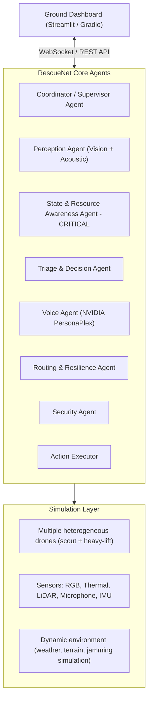

# RescueNet AI - Autonomous Disaster Response System

**Version:** 1.0 (Production Ready)  
**Date:** March 2026  
**Owner:** @revailace  
**Status:** Production Hardened  

---

## 🚀 Quick Start

### Installation
```bash
# Clone the repository
git clone <repository-url>
cd rescuenet-ai

# Create virtual environment (recommended)
python -m venv venv
source venv/bin/activate  # On Windows: venv\Scripts\activate

# Install dependencies
pip install -r requirements.txt
```

### Running the System

#### 1. Demo Mode (Recommended for Testing)
```bash
# Basic demo with 5 ticks
python main.py --mode demo

# Demo with more ticks and verbose logging
python main.py --mode demo --ticks 10 --verbose

# Using environment variables
export RESCUENET_MODE=demo
export RESCUENET_MOCK_SEED=123
python main.py --ticks 8
```

#### 2. Sim Mode (AirSim Integration)
```bash
# Requires AirSim simulator running
python main.py --mode sim --ticks 5

# With custom AirSim host/port
export RESCUENET_AIRSIM_HOST=192.168.1.100
export RESCUENET_AIRSIM_PORT=41451
python main.py --mode sim
```

#### 3. Dashboard Mode (Web Interface)
```bash
# Start the Streamlit dashboard
cd dashboard
streamlit run app.py

# Or from project root
python -m streamlit run dashboard/app.py
```

#### 4. Configuration File
Create `config.json` in the project root:
```json
{
    "mode": "demo",
    "mock_seed": 42,
    "mock_num_drones": 3,
    "mock_num_victims": 4,
    "log_level": "INFO"
}
```

---

## 📋 Runtime Modes

### Demo Mode (`--mode demo`)
- **Purpose**: Testing and development without external dependencies
- **Features**:
  - Mock environment with configurable random seed
  - 3 drones and 4 victims by default
  - Deterministic behavior for reproducible testing
  - No external simulator required
- **Use Cases**:
  - Unit testing
  - Algorithm development
  - CI/CD pipelines
  - Quick prototyping

### Sim Mode (`--mode sim`)
- **Purpose**: Integration with AirSim for realistic simulation
- **Features**:
  - Connects to AirSim simulator via TCP
  - Uses structured data contracts for telemetry and commands
  - Lazy imports (AirSim dependencies only loaded when needed)
  - Clear error messages if AirSim is unavailable
- **Requirements**:
  - AirSim simulator running
  - AirSim Python client installed
  - Network connectivity to simulator host
- **Use Cases**:
  - Hardware-in-the-loop testing
  - Realistic mission simulations
  - Sensor data processing validation

### Dashboard Mode
- **Purpose**: Real-time monitoring and control
- **Features**:
  - Web-based interface (Streamlit)
  - Real-time fleet status visualization
  - Mission tracking and control
  - Triage priority display
  - Auto-refresh capabilities
- **Access**: http://localhost:8501

---

## 🔧 Configuration

### Priority Order
1. **Command-line arguments** (highest priority)
2. **Environment variables**
3. **Config file** (`config.json`)
4. **Default values**

### Environment Variables
| Variable | Description | Default |
|----------|-------------|---------|
| `RESCUENET_MODE` | Runtime mode: `demo` or `sim` | `demo` |
| `RESCUENET_MOCK_SEED` | Random seed for demo mode | `42` |
| `RESCUENET_MOCK_NUM_DRONES` | Number of drones in demo | `3` |
| `RESCUENET_MOCK_NUM_VICTIMS` | Number of victims in demo | `4` |
| `RESCUENET_AIRSIM_HOST` | AirSim simulator host | `localhost` |
| `RESCUENET_AIRSIM_PORT` | AirSim simulator port | `41451` |
| `RESCUENET_LOG_LEVEL` | Logging level | `INFO` |

### Command-line Arguments
```bash
python main.py --help
```
- `--mode demo|sim`: Runtime mode selection
- `--ticks N`: Number of simulation ticks (default: 5)
- `--verbose` or `-v`: Enable debug logging
- `--help`: Show help message

---

## 🏗️ System Architecture

## ⚠️ Key Assumptions & Current Limitations

### Assumptions
1. **Demo Mode**: Provides realistic but synthetic data for testing
2. **Sim Mode**: AirSim integration uses placeholder adapter until full AirSim client is installed
3. **Tick-based Simulation**: Time advances in discrete ticks (1 tick ≈ 1-2 seconds of real time)
4. **Deterministic Behavior**: Demo mode with same seed produces identical results
5. **Modular Architecture**: Agents can be developed and tested independently

### Current Limitations
1. **AirSim Integration**: Sim mode uses structured contracts but requires actual AirSim installation for full functionality
2. **Scalability**: Tested with 3-5 drones; larger fleets may require optimization
3. **Real-time Performance**: Not optimized for sub-second response times
4. **Persistence**: No database or long-term state storage between runs
5. **Error Recovery**: Basic error handling; limited automatic recovery from failures

### Production Readiness Checklist
- [x] **Demo Mode**: Fully functional and tested
- [x] **Sim Mode**: Activation path ready (requires AirSim installation)
- [x] **Dashboard**: Real-time monitoring available
- [x] **Logging**: Configurable logging with multiple levels
- [x] **Configuration**: Multiple configuration sources with priority ordering
- [x] **Error Handling**: Clear error messages and graceful degradation
- [ ] **AirSim Client**: Requires external AirSim Python package installation
- [ ] **Performance Metrics**: Basic metrics available; advanced monitoring needed
- [ ] **Deployment**: Manual deployment; containerization recommended for production

### Troubleshooting

#### Demo Mode Issues
```bash
# If demo mode fails to start
python main.py --mode demo --verbose  # Enable debug logging
export RESCUENET_LOG_LEVEL=DEBUG      # Set debug level via env var
```

#### Sim Mode Issues
```bash
# If sim mode fails to connect
# 1. Check AirSim is running
# 2. Verify host and port
export RESCUENET_AIRSIM_HOST=localhost
export RESCUENET_AIRSIM_PORT=41451
python main.py --mode sim --verbose

# Fallback to demo mode if AirSim unavailable
python main.py --mode demo
```

#### Dashboard Issues
```bash
# If dashboard fails to start
cd dashboard
pip install streamlit  # Ensure Streamlit is installed
streamlit run app.py --server.port 8501

# Check for port conflicts
streamlit run app.py --server.port 8502
```

---

## 1. Project Overview

RescueNet AI is an intelligent multi-agent AI platform that serves as the central brain for entire fleets of drones and sensors.

**Main Purpose**  
In real disasters (earthquakes, floods, conflict zones, etc.), humans often panic and centralized command breaks down. RescueNet solves this by autonomously detecting survivors, analysing injuries in real time, performing dynamic triage, and coordinating multiple drone fleets simultaneously — without waiting for constant human instructions.

The system maintains continuous real-time awareness of its entire fleet. It constantly monitors every drone's battery levels, mechanical condition, sensor health, payload status, and environmental data through uplink checks. Using this live information, the AI makes smart and safe decisions.

It can instantly redirect resources: some drones survey affected areas, others deliver first-aid kits and supplies, while groups of heavy-lift drones collaborate to extract victims from rubble or floodwaters. It also provides calm, real-time two-way voice guidance to victims using NVIDIA PersonaPlex in local languages.

When lives are at stake, the AI takes the lead. Human oversight is available but not required for every decision.

When there is no active emergency, the same platform can be repurposed for infrastructure inspections, agriculture surveys, security monitoring, or other practical tasks. This keeps the fleets active and useful year-round.

---

## 2. Vision and Core Philosophy

- The AI is resource-aware and proactive.
- It has full self-awareness of every drone's capabilities and current state.
- Human oversight exists, but the system is designed to act independently when every second counts.
- We are building an intelligent commander, not just a delivery controller.
- Practical first: simulation MVP now, real hardware later.

---

## 3. High-Level Architecture



---

## 4. Detailed Agent Descriptions

### State and Resource Awareness Agent (CRITICAL)

- Maintains a live `FleetState` object updated every 1-2 seconds via uplink.
- Tracks for every drone: battery %, mechanical condition, sensor health, payload status, and environmental data (wind speed, precipitation, visibility, temperature).
- Provides intelligent helper functions like `can_perform_mission(drone_id, task_type, estimated_duration)` that return True/False with reasoning.
- Feeds live data to every other agent so all decisions are grounded in real fleet state.
- Prevents unsafe task assignments automatically, without needing explicit rules for every edge case.

### Perception Agent

- Processes RGB and thermal camera feeds.
- Detects people and estimates injury severity using pre-trained vision models.
- Acoustic detection (screams, voice, claps) with propeller noise cancellation.

### Triage and Decision Agent

- Uses perception data and fleet state to assign priority scores to victims.
- Decides optimal drone assignments based on proximity, payload, and battery.

### Coordinator / Supervisor Agent

- Oversees the entire agent graph.
- Handles re-tasking and conflict resolution between agents.
- Manages mode switching (Disaster vs Normal operations).

### Voice Agent

- Uses NVIDIA PersonaPlex for calm, natural, full-duplex two-way voice guidance.
- Generates contextual first-aid instructions based on triage output.
- Supports multiple languages (Nepali, English for MVP).

### Routing and Resilience Agent

- Primary navigation using standard flight paths.
- Falls back to Visual SLAM and LiDAR when GPS is lost.
- Handles jamming fallback: frequency hopping, then mesh networking between drones.
- Uses store-and-forward for data when all links are temporarily down.

### Security Agent

- Monitors continuously for signal jamming, spoofing, and anomalous commands.
- Manages encrypted communications on all links including fallback channels.
- Logs every critical action and state change for post-mission audit.

---

## 5. MVP Scope (What We Will Deliver)

### Must Have

- Simulation with 3-5 drones (mix of scout and heavy-lift types)
- Live fleet state monitoring (battery, condition, sensors, environmental data)
- Autonomous victim detection, triage scoring, and drone re-tasking
- One complete rescue scenario from scan to supply delivery
- Basic voice output (TTS first-aid instructions)
- Dashboard showing real-time drone statuses and AI decisions
- Mode switching (Disaster vs Normal)

### Nice to Have

- Two-way PersonaPlex voice (listen + respond)
- AI suggesting hardware adaptations based on environment analysis
- Simulated jamming scenario with mesh fallback demo
- Multi-drone collaborative extraction (4-5 drones working together on one victim)

---

## 6. Tech Stack

| Component | Choice |
|-----------|--------|
| Simulation | AirSim (recommended to start) or NVIDIA Isaac Sim |
| Multi-Agent Framework | LangGraph |
| Vision Models | YOLOv8 / CLIP + thermal processing |
| Voice | NVIDIA PersonaPlex API (or simulated TTS for MVP) |
| Dashboard | Streamlit or Gradio |
| Cloud | Vultr A100 / H100 instances ($250 credit per team member) |
| Language | Python 3.11+ |

---

## 7. Project Folder Structure

```text
rescuenet-ai/
├── agents/
│   ├── coordinator.py         # Supervisor agent - oversees full graph
│   ├── perception.py          # Vision + acoustic detection
│   ├── state_awareness.py     # CRITICAL - live fleet state + decision helpers
│   ├── triage.py              # Priority scoring + drone assignment
│   ├── voice.py               # PersonaPlex integration
│   ├── routing.py             # Navigation + jamming fallback
│   └── security.py            # Encryption, spoofing detection, audit logging
├── simulation/                # AirSim / Isaac Sim wrappers and helpers
├── state/                     # FleetState class + live update logic
├── dashboard/                 # Streamlit / Gradio frontend
├── utils/                     # Shared helpers, logging, config
├── config.py                  # Central configuration
├── main.py                    # Entry point - launches graph + simulation
├── requirements.txt
└── README.md
```

---

## 8. FleetState - Key Data Structure

```python
# state/fleet_state.py

@dataclass
class DroneState:
    drone_id: str
    battery_percent: float          # 0-100
    mechanical_health: str          # "ok" | "degraded" | "critical"
    sensor_status: dict             # {"rgb": "ok", "thermal": "ok", "lidar": "degraded"}
    payload_kg: float               # Current payload weight
    winch_status: str               # "ready" | "deployed" | "fault"
    position: tuple                 # (lat, lon, alt) or SLAM coords
    wind_speed_ms: float            # From onboard environmental sensor
    temperature_c: float
    visibility_m: float
    current_mission: str | None     # Current task ID or None

class FleetState:
    drones: dict[str, DroneState]

    def can_perform_mission(self, drone_id: str, task_type: str, estimated_duration_min: float) -> tuple[bool, str]:
        """
        Returns (True, "") if drone can take the mission.
        Returns (False, reason) if it cannot.
        Used by all agents before assigning any task.
        """
        ...

    def get_best_drone_for(self, task_type: str, location: tuple) -> str | None:
        """
        Returns drone_id of the best available drone for a given task and location.
        Considers battery, proximity, payload, and current load.
        """
        ...
```

---

## 9. Development Plan (3 Weeks)

### Week 1 - Foundation

- Set up AirSim environment with 3-5 drones
- Build `FleetState` class and State Awareness Agent
- Create basic Streamlit dashboard showing drone telemetry
- Set up LangGraph skeleton with placeholder agents

### Week 2 - Intelligence Layer

- Implement Perception Agent (victim detection via YOLOv8 + thermal)
- Build Triage and Decision Agent with priority scoring
- Add Coordinator with re-tasking logic based on fleet state
- Basic voice output (TTS first-aid instructions)

### Week 3 - Full Demo + Polish

- Wire up full rescue scenario end-to-end
- Add mode switching (Disaster vs Normal)
- Add Security Agent and simulated jamming fallback
- Dashboard polish and demo recording
- Prepare final presentation

---

## 10. Vultr Cloud Setup

- $250 credit per team member is more than enough for the hackathon.
- Spin up one shared A100 PCIe (40GB) instance for simulation (~$1.29-$2.40/hr).
- Each team member can use a smaller instance for code testing.
- Always stop instances when not actively running to conserve credits.
- Estimated total spend for 3 weeks of development: well under $200 per person.

---

## 11. Future Expansion (Post-Hackathon)

- Real hardware integration (NemoClaw, Unitree, custom drones)
- AI hardware suggestion feature: system analyses terrain and recommends physical adaptations to human operators (e.g. frame configuration changes for tight spaces)
- Full swarm behaviour with 20+ drones
- Post-mission analysis and learning loop
- API integration layer for third-party use cases (company incident monitoring, agriculture, security patrols)

---

## 12. Next Steps for the Team

1. Confirm this documentation matches our shared vision.
2. Set up the GitHub repo and add this file.
3. Quick call to assign agents and modules to team members.
4. Start with AirSim setup + FleetState class in parallel.
5. Ship.

---

*End of Document*
